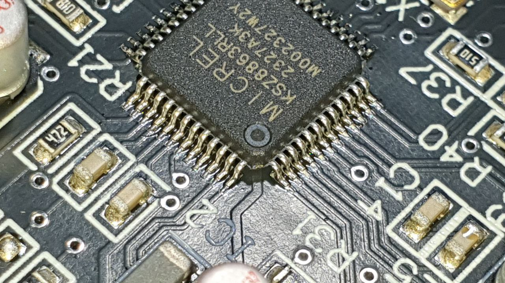

# Universal WLED board with ethernet switch

Started as a dedicated board for the Cyberlamp project this hardware developed into an universal WLED board for professional installations.

## Features
* WLED compatible
* Input Voltage 5-24V
* Integrated Ethernet switch for daisy chaining
* 6 LED outputs with 5V signal level
* 5A per output, 16A total
* Every output fused individually
* Output using 2.54mm pins or AKZ500 screw terminals
* 2 fan connectors with PWM
* Connector for DS18B12 temperature sensors
* Connector for I2S microphones (shared with LED output 4/5)
* LEDs can be disabled with jumpers
* Reverse protection diode, will short-circuit the supply if reversed
* Board size 110 x 80mm

## Building it
PCB manufacturing data (gerber), schematic and (mostly) mouser BOM are available in directory "hardware/releases/". PCB was manufactured by JLCPCB including stencil, but hand soldering is an option (L1 needs hot air soldering).

## Cost
BOM costs are around 45€ + Board + Stencil

## Software
Compatible with my fork of WLED, available [here](https://github.com/Bauteiltoeter/WLED2/tree/cyberlamp).

